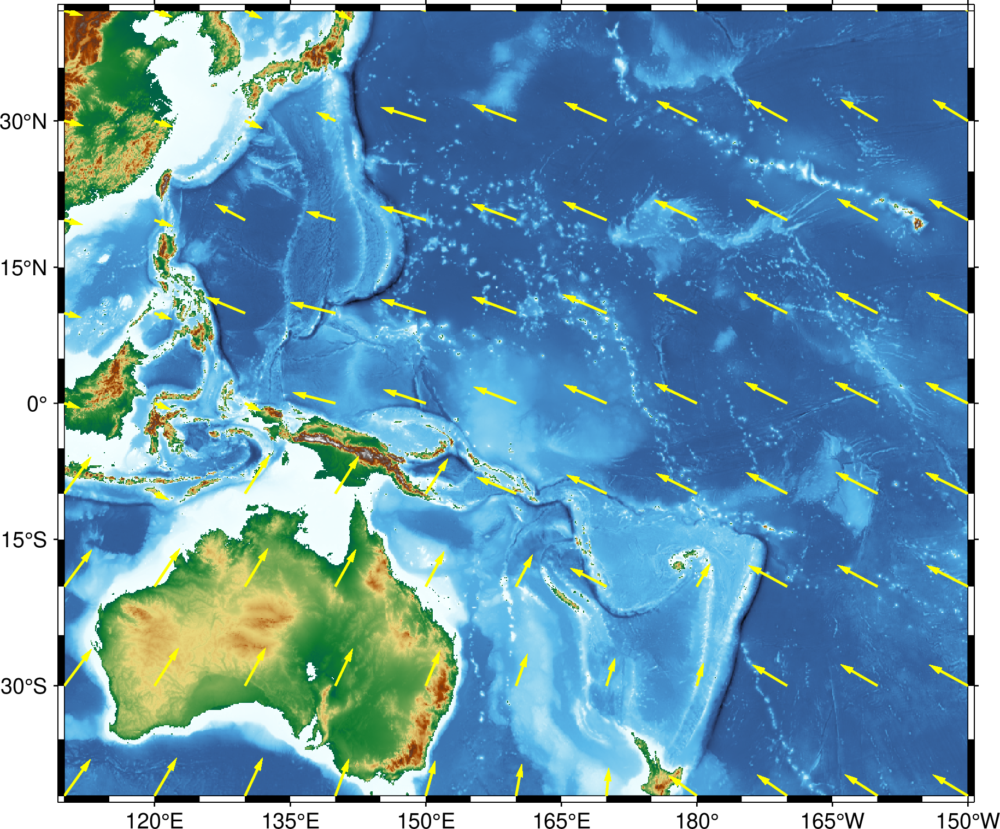

# Demonstrations

Please check the [README](../../README.md) for a quick overview.
To follow these demonstrations, it is first necessary to get some plate motion data:

```julia
julia> using PlateMotionRequests
julia> latitudes = -40:10:40
julia> longitudes = 110:10:210
julia> GSRMdata = platemotion(
           repeat(latitudes, length(longitudes)),
           repeat(longitudes, inner = length(latitudes)),
       )
```


## Acessing response data

The data is stored in a [`Table`](https://typedtables.juliadata.org/latest/man/table/).
Note that the calculator knows how to handle longitude values greater than 180°,
but whatever values are given will also end up in the response table.
The number and name of the columns depends on the requested format.
To list the available columns, use `columnnames`:

```julia
julia> using TypedTables  # install this package using `] add TypedTables`
julia> columnnames(GSRMdata)
(:lon, :lat, :velocity_east, :velocity_north, :plate_and_reference, :model)
```

Columns are accessed as fields of the table, e.g.:

```julia
julia> GSRMdata.velocity_east
99-element Vector{Float64}:
  40.67
  42.17
  42.4
  41.35
  24.79
  27.08
  28.56
  29.17
  28.9
  34.18
  37.13
  38.95
   ⋮
 -61.79
 -56.93
 -50.35
 -54.32
 -60.03
 -63.91
 -65.85
 -65.81
 -63.78
 -59.82
 -54.05
 -46.64
```

Rows are accessed by index, e.g.:

```julia
julia> GSRMdata[1]
(lon = 110.0, lat = -40.0, velocity_east = 40.67, velocity_north = 56.92, plate_and_reference = "AU(NNR)", model = "GSRM v2.1")
julia> typeof(ans)
NamedTuple{(:lon, :lat, :velocity_east, :velocity_north, :plate_and_reference, :model), Tuple{Float64, Float64, Float64, Float64, String, String}}
```

For more advanced manipulations, refer to the documentation for `TypedTables` and `Table`.


## Plotting plate motion on a map using GMT

To plot the plate motion using [GMT](https://www.generic-mapping-tools.org/),
install the [GMT.jl](https://github.com/GenericMappingTools/GMT.jl) julia package.
The `grdvector` function can be used to plot the vectors.

```
julia> using GMT

julia> gmtbegin("platemotion.png")

julia> grdimage(
           "@earth_relief_06m",
           region = (minimum(longitudes), maximum(longitudes), minimum(latitudes), maximum(latitudes)),
           frame = :auto,
           projection = :Mercator,
       )

julia> grdvector(
           mat2grid(reshape(GSRMdata.velocity_east, length(latitudes), length(longitudes)), x = longitudes, y = latitudes),
           mat2grid(reshape(GSRMdata.velocity_north, length(latitudes), length(longitudes)), x = longitudes, y = latitudes),
           fill = :yellow,
           arrow = (; shape = 0, stop = true, length = 0.2, pen = :yellow),
           vec_scale = 100,
           linewidth = :thick,
           linecolor = :yellow,
       )

julia> gmtend(show = true)
```



Alternatively, save the data to a file for external analysis or visualisation:

```julia
julia> write_platemotion("platemotion.dat", GSRMdata)
```
